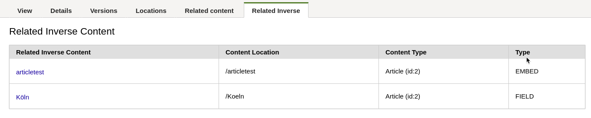

eZPlatform 1.x 
== THIS BUNDLE IS NOT FOR PRODUCTION USE ==

# RelatedInverseContentBundle
This is a dev Bundle to add new content detail tab where you can get more information about related inverse content.

## Install

1. Create src/**Ez** folder
2. Switch to the **Ez** folder and then clone the repository
```
    git clone https://github.com/ramzi-arfaoui/EzRelatedInverseContentBundle.git
```
3. add in AppKernel.php

```
    public function registerBundles()
    {
        $bundles = array(
            //...
            new Ez\RelatedInverseContentBundle\EzRelatedInverseContentBundle(),

```

4. Add following route in config/routing.yml
```
ez_related_inverse_content:
    resource: "@EzRelatedInverseContentBundle/Resources/config/routing.yml"
    prefix:   /
```
5. Install bundle assets, dumps  assets to the filesystem and clear cache
```
app/console assets:install --symlink --relative
app/console assetic:dump
app/console cache:clear
```
6. Go to the backend, the new tab should be now available

## Test
There is a route that you can use it to see results if you want to make some tests on related inverse content 

```
/contentinverserelations/<CONTENT-ID>
```
Check following Controller to print results
```
/Ez/RelatedInverseContentBundle/Controller/ContentRelationInverseController.php
```
## TODO

- Fix the hard coded contentID in JS plugin
- Fix the translation texts

## Screenshot


